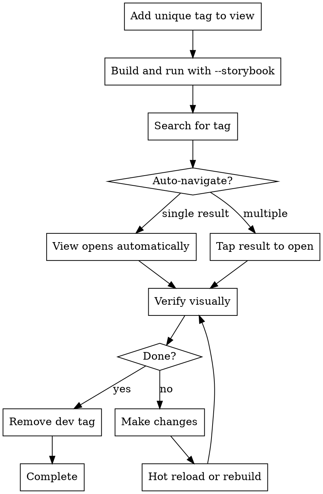

# Verifying with Storybook

## Overview

Storybook-SwiftUI enables instant visual verification of SwiftUI views during development. Tag views with unique identifiers, launch the app directly to Storybook, and automatically navigate to the specific view being developed.

**Core principle:** Visual verification should be as fast as running a test - tag it, launch it, see it.

## When to Use

Use this workflow when:
- Implementing new SwiftUI views or components
- Fixing UI bugs that require visual verification
- Iterating on design implementations
- Need to verify view appears correctly across different states

Don't use when:
- Pure logic changes with no UI impact
- Working on backend/API code
- Unit testing is sufficient for verification

## Setup: Launch Arguments

To enable direct launch to Storybook, configure your app's launch arguments:

### 1. Add Launch Argument Handler

In your app's entry point or SceneDelegate:

```swift
import Storybook
import SwiftUI

@main
struct MyApp: App {
    var body: some Scene {
        WindowGroup {
            if ProcessInfo.processInfo.arguments.contains("--storybook") {
                Storybook.render()
            } else {
                ContentView()
            }
        }
    }
}
```

### 2. Configure Xcode Scheme

Edit Scheme → Run → Arguments → Arguments Passed On Launch:
- Add: `--storybook`
- Leave unchecked by default
- Check when you want to launch directly to Storybook

**Tip:** Create a separate scheme called "Storybook" with this argument always enabled.

## Tagging for Navigation

### Use Unique Tags for Development

When creating or modifying a view, add a unique tag using a UUID:

```swift
extension Storybook {
    @objc static let myButton = StorybookPage(
        folder: "/Design System/Buttons",
        views: [
            PrimaryButton()
                .storybookTitle("Primary")
                .storybookTags("dev-12a34b56")  // Unique tag for this session
        ]
    )
}
```

**Why UUIDs work well:**
- Guaranteed unique across all views
- Easy to search (no conflicts)
- Can be temporary (remove after verification)
- Auto-navigate works (single result)

### Generate UUID

```bash
# macOS/Linux
uuidgen | tr '[:upper:]' '[:lower:]' | cut -c1-8
# Example: 3f1b16a2

# Or in code
UUID().uuidString.lowercased().prefix(8)
```

## Verification Workflow

### Standard Flow



### Quick Reference

| Step | Command/Action | Example |
|------|---------------|---------|
| Generate tag | `uuidgen \| tr '[:upper:]' '[:lower:]' \| cut -c1-8` | `dev-3f1b16a2` |
| Add to view | `.storybookTags("dev-{uuid}")` | `.storybookTags("dev-3f1b16a2")` |
| Launch | Enable `--storybook` argument and run | Xcode Run ▶ |
| Navigate | Search `#{tag}` in Storybook | `#dev-3f1b16a2` |
| Verify | View opens automatically if unique | Visual inspection |
| Clean up | Remove dev tag before commit | Delete `.storybookTags()` line |

## Complete Example

**Scenario:** Building a new profile card component

```swift
// 1. Create the view
struct ProfileCard: View {
    let name: String
    let avatar: String

    var body: some View {
        HStack {
            Image(systemName: avatar)
                .font(.largeTitle)
            Text(name)
                .font(.headline)
        }
        .padding()
        .background(Color.gray.opacity(0.1))
        .cornerRadius(8)
    }
}

// 2. Add to Storybook with unique dev tag
extension Storybook {
    @objc static let profileCard = StorybookPage(
        folder: "/Components/Profile",
        views: [
            ProfileCard(name: "John Doe", avatar: "person.circle")
                .storybookTitle("Default State")
                .storybookTags("dev-a7c8f3e1"),  // ← Unique tag
            ProfileCard(name: "Jane Smith", avatar: "person.circle.fill")
                .storybookTitle("Filled Avatar")
                .storybookTags("profile-card")   // ← Semantic tag (stays)
        ]
    )
}

// 3. Launch app with --storybook argument
// 4. Search: #dev-a7c8f3e1
// 5. View opens automatically
// 6. Iterate: make changes → hot reload → verify
// 7. Before commit: remove dev-a7c8f3e1 tag, keep profile-card tag
```

## Tag Management Strategy

### Temporary Dev Tags
- Format: `dev-{short-uuid}`
- Purpose: Navigate during active development
- Lifecycle: Add when starting work, remove before commit
- Unique per development session

### Permanent Semantic Tags
- Format: Descriptive names (`button`, `primary-cta`, `error-state`)
- Purpose: Organize and categorize components
- Lifecycle: Commit with the code
- Shared across similar components

```swift
// Good: Both temporary and permanent tags
.storybookTags("dev-3f1b16a2", "button", "primary-cta")

// During dev: search #dev-3f1b16a2 (unique, auto-navigates)
// After dev: search #button or #primary-cta (find related components)
```

## Common Mistakes

### ❌ Using Non-Unique Tags for Dev
```swift
.storybookTags("button")  // Too many results, no auto-navigation
```
**Fix:** Use UUID-based tag for development work

### ❌ Forgetting to Remove Dev Tags
```swift
.storybookTags("dev-a7c8f3e1")  // ← Still in code after commit
```
**Fix:** Always clean up dev tags before committing. Semantic tags should stay.

### ❌ Not Setting Up Launch Argument
Running full app → navigating to test → finding Storybook
**Fix:** Configure `--storybook` argument to launch directly

### ❌ Reusing Same Dev Tag
Using `dev-current` for multiple views across sessions
**Fix:** Generate fresh UUID for each new development task

## Integration with Development Workflow

### For AI Agents

When implementing UI changes:
1. Generate unique tag: `tag=$(uuidgen | tr '[:upper:]' '[:lower:]' | cut -c1-8)`
2. Add to view: `.storybookTags("dev-$tag")`
3. Build/run with `--storybook`
4. Search `#dev-$tag` to verify
5. Iterate until correct
6. Remove dev tag before completion

### For Human Developers

**During development:**
- Enable Storybook scheme
- Add dev tag to view you're working on
- Search tag whenever you rebuild
- Visual feedback loop is immediate

**Before commit:**
- Review diffs for any `dev-` tags
- Remove temporary tags
- Keep semantic tags for organization

## Troubleshooting

**View doesn't auto-open:**
- Ensure tag is truly unique (only one view has it)
- Check search includes `#` prefix
- Verify tag search returns exactly 1 result

**Can't find view:**
- Confirm view is added to Storybook extension
- Check tag spelling matches exactly
- Try searching without `#` to see all matches

**Launch argument not working:**
- Verify scheme has `--storybook` argument
- Check argument is enabled (checked)
- Ensure app code checks `ProcessInfo.processInfo.arguments`
